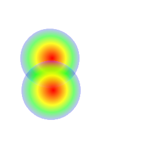

![Built With Capacitor](https://img.shields.io/badge/-Built%20With%20Capacitor-16161d.svg?logo=data%3Aimage%2Fsvg%2Bxml%3Bbase64%2CPD94bWwgdmVyc2lvbj0iMS4wIiBlbmNvZGluZz0idXRmLTgiPz4KPCEtLSBHZW5lcmF0b3I6IEFkb2JlIElsbHVzdHJhdG9yIDE5LjIuMSwgU1ZHIEV4cG9ydCBQbHVnLUluIC4gU1ZHIFZlcnNpb246IDYuMDAgQnVpbGQgMCkgIC0tPgo8c3ZnIHZlcnNpb249IjEuMSIgaWQ9IkxheWVyXzEiIHhtbG5zPSJodHRwOi8vd3d3LnczLm9yZy8yMDAwL3N2ZyIgeG1sbnM6eGxpbms9Imh0dHA6Ly93d3cudzMub3JnLzE5OTkveGxpbmsiIHg9IjBweCIgeT0iMHB4IgoJIHZpZXdCb3g9IjAgMCA1MTIgNTEyIiBzdHlsZT0iZW5hYmxlLWJhY2tncm91bmQ6bmV3IDAgMCA1MTIgNTEyOyIgeG1sOnNwYWNlPSJwcmVzZXJ2ZSI%2BCjxzdHlsZSB0eXBlPSJ0ZXh0L2NzcyI%2BCgkuc3Qwe2ZpbGw6I0ZGRkZGRjt9Cjwvc3R5bGU%2BCjxwYXRoIGNsYXNzPSJzdDAiIGQ9Ik00MjQuNywzNzMuOWMwLDM3LjYtNTUuMSw2OC42LTkyLjcsNjguNkgxODAuNGMtMzcuOSwwLTkyLjctMzAuNy05Mi43LTY4LjZ2LTMuNmgzMzYuOVYzNzMuOXoiLz4KPHBhdGggY2xhc3M9InN0MCIgZD0iTTQyNC43LDI5Mi4xSDE4MC40Yy0zNy42LDAtOTIuNy0zMS05Mi43LTY4LjZ2LTMuNkgzMzJjMzcuNiwwLDkyLjcsMzEsOTIuNyw2OC42VjI5Mi4xeiIvPgo8cGF0aCBjbGFzcz0ic3QwIiBkPSJNNDI0LjcsMTQxLjdIODcuN3YtMy42YzAtMzcuNiw1NC44LTY4LjYsOTIuNy02OC42SDMzMmMzNy45LDAsOTIuNywzMC43LDkyLjcsNjguNlYxNDEuN3oiLz4KPC9zdmc%2BCg%3D%3D&colorA=16161d&style=flat-square)


# CapacitorHeatmap

[](https://github.com/abritopach) [](https://www.npmjs.com/package/capacitor-heatmap)
[](https://www.npmjs.com/package/capacitor-heatmap) [](https://github.com/abritopach/capacitor-heatmap/blob/master/LICENSE)

**If this project has been useful to you and you want to help me to keep contributing to the open source with projects, examples, plugins,... collaborate and buy me a coffee.**


<a href="https://www.buymeacoffee.com/h6WVj4HcD" target="_blank"></a>

Capacitor Heatmap is a custom Native Capacitor plugin to show Heatmap on Web, IOS and  Android platforms.

Currently you can choose from **four types** of heatmaps with only one plugin :) (only WEB at this moment):

<table>
  <tr>
    <td>Simple Heatmap</td>
     <td>Google Maps Heatmap</td>
     <td>Leaflet Maps Heatmap</td>
     <td>Mapbox Maps Heatmap</td>
  </tr>
  <tr>
    <td></td>
    <td></td>
    <td></td>
    <td></td>
  </tr>
 </table>

## Simple Heatmap


## Google Maps Heatmap


## Leaflet Maps Heatmap


## Mapbox Maps Heatmap


# Capacitor

Capacitor is a cross-platform API and code execution layer that makes it easy to call Native SDKs from web code and to write custom Native plugins that your app might need. Additionally, Capacitor provides first-class Progressive Web App support so you can write one app and deploy it to the app stores, and the mobile web.

Capacitor is being designed by the Ionic Framework team as an eventual alternative to Cordova, though backwards compatibility with Cordova plugins is a priority and is actively being worked on. Capacitor can be used without Ionic Framework, but soon it'll become a core part of the Ionic developer experience.

Capacitor also comes with a Plugin API for building native plugins. On iOS, first-class Swift support is available, and much of the iOS Capacitor runtime is written in Swift. Plugins may also be written in Objective-C. On Android, support for writing plugins with Java and Kotlin is supported.

## Capacitor Heatmap WEB Interfaces & Types

```bash

INTERFACES & TYPES

/**
 * Description [Interface to define heatmap logs.]
 *
 * @author abrito
 * @version 0.0.1
 *
 * @interface
*/
export interface HeatmapLog {
    log(primaryMessage: string, ...supportingData: any[]): void;
    debug(primaryMessage: string, ...supportingData: any[]): void;
    warn(primaryMessage: string, ...supportingData: any[]): void;
    error(primaryMessage: string, ...supportingData: any[]): void;
    info(primaryMessage: string, ...supportingData: any[]): void;
}

/**
 * Description [Interface to define color scale options.]
 *
 * @author abrito
 * @version 0.0.1
 *
 * @interface
*/
export interface ColorScale {
    show: boolean;
    position?: {
        vertical: VerticalPosition;
        horizontal: HorizontalPosition;
    };
    boxShadow?: string;
    text?: {
        start?: string;
        end?: string;
        color?: string;
    },
    background?: string;
    gradientColorMode?: 'original' | 'inverted'
}

/**
 * Description [Interface to define color scale styles.]
 *
 * @author abrito
 * @version 0.0.1
 *
 * @interface
*/
export interface ColorScaleStyles {
    width: number;
    height: number;
    borderRadius: string;
    position: string;
    zIndex: string;
    marginTop: string;
    margin: string;
    padding: string;
    boxShadow: string;
    fillTextStart: string;
    fillTextEnd: string;
    fillTextColor: string;
    background: string;
}

/**
 * Description [Interface to define simple heatmap initialize options.]
 *
 * @author abrito
 * @version 0.0.1
 *
 * @interface
*/
export interface HeatmapOptions {
    element: string;
    type: HeatmapType;
    data?: HeatmapData;
    debug?: boolean;
    colorScale?: ColorScale;
}

/**
 * Description [Interface to define simple heatmap point.]
 *
 * @author abrito
 * @version 0.0.1
 *
 * @interface
*/
export interface Coordinate {
    x: number;
    y: number;
}

/**
 * Description [Interface to define simple heatmap point.]
 *
 * @author abrito
 * @version 0.0.1
 *
 * @interface
*/
export interface Point {
    x: number;
    y: number;
    thickness: number;
}

export enum HeatmapType {
    Simple = 'simple',
    GoogleMaps = 'googlemaps',
    LeafletMaps = 'leafletmaps',
    MapboxMaps = 'mapboxmaps'
}

/**
 * Description [Interface to define heatmap draw options.]
 *
 * @author abrito
 * @version 0.0.1
 *
 * @interface
*/
export interface HeatmapDrawOptions {
    opacity?: number,
    radius?: number,
    gradient?: HeatmapGradient | GMHeatmapGradient
    data?:  HeatmapData | GMHeatmapData | LMHeatmapData | MapboxHeatmapData
}

export type HeatmapGradient = Record<number, string>;
export type HeatmapPoint = number[] | Point;
export type HeatmapPosition = number[] | Coordinate;
export type HeatmapData = (number[] | Point)[];

/**
 * Description [Interface to define google maps heatmap initialize options.]
 *
 * @author abrito
 * @version 0.0.1
 *
 * @interface
*/
export interface GMHeatmapOptions {
    map: google.maps.Map;
    type: HeatmapType;
    data?: GMHeatmapData;
    debug?: boolean;
}

export type GMHeatmapGradient = string[];
export type GMHeatmapPoint = google.maps.LatLng | google.maps.visualization.WeightedLocation;
export type GMHeatmapCoordinate = google.maps.LatLng;
export type GMHeatmapData = google.maps.MVCArray<google.maps.LatLng | google.maps.visualization.WeightedLocation>;


/**
 * Description [Interface to define leaflet maps heatmap initialize options.]
 *
 * @author abrito
 * @version 0.0.1
 *
 * @interface
*/
export interface LMHeatmapOptions {
    map: Map;
    type: HeatmapType;
    data?: LMHeatmapData;
    debug?: boolean;
}

export type LMHeatmapData = LatLngExpression[];
export type LMHeatmapPoint = LatLngExpression;
export type LMHeatmapCoordinate = LatLngTuple;

/**
 * Description [Interface to define mapbox maps heatmap initialize options.]
 *
 * @author abrito
 * @version 0.0.1
 *
 * @interface
*/
export interface MapboxHeatmapOptions {
    map: mapboxgl.Map;
    type: HeatmapType;
    data?: MapboxHeatmapData;
    debug?: boolean;
}

/**
 * Description [Interface to define location.]
 *
 * @author abrito
 * @version 0.0.1
 *
 * @interface
*/
export interface Location {
    lat: number;
    long: number;
    thickness?: number;
}

export type MapboxHeatmapData = (number[] | Location)[];
export type MapBoxHeatmapPoint = Location;
export type MapboxHeatmapCoordinate = [number, number] | Location;

```

## Capacitor Heatmap WEB public API methods.

### `initialize(options: IHeatmapOptions | IGMHeatmapOptions | ILMHeatmapOptions | MapboxHeatmapOptions): Promise<{value: HTMLCanvasElement | google.maps.visualization.HeatmapLayer | mapboxgl.Map}>`

```bash
Initialize heatmap.

async initializeHeatmap() {
    const options = {element: 'your-element-id', debug: true}};
    const result = await Heatmap.initialize(options);
    console.log('result', result);
}

```

#### Returns

Type: `Promise<{value: HTMLCanvasElement | google.maps.visualization.HeatmapLayer | mapboxgl.Map}>`


### `destroy(): Promise<{value: HTMLCanvasElement | google.maps.visualization.HeatmapLayer}>`

```bash
Destroy heatmap.

async destroyHeatmap() {
    const result = await Heatmap.destroy();
    console.log('result', result);
}

```


### 📈 Methods for handling heatmap data.

### `setData(data: HeatmapData | GMHeatmapData | LMHeatmapData | MapboxHeatmapData): Promise<{value: HeatmapData | GMHeatmapData | LMHeatmapData | MapboxHeatmapData}>`

```bash
Set heatmap data of [[x, y, thickness], ...] or [{x: value, y: value, thickness: value},...] format.

const d = await Heatmap.setData(this.data);

```

#### Returns

Type: `Promise<{value: HeatmapData | GMHeatmapData | LMHeatmapData | MapboxHeatmapData}>`


### `getData(): Promise<{value: HeatmapData | GMHeatmapData | LMHeatmapData | MapboxHeatmapData}>`

```bash
Get heatmap data of [[x, y, thickness], ...] format.

const d = await Heatmap.getData();

```

#### Returns

Type: `Promise<{value: HeatmapData | GMHeatmapData | LMHeatmapData | MapboxHeatmapData}>`


### ` getValueAt(position: HeatmapPosition | GMHeatmapCoordinate | LMHeatmapCoordinate | MapboxHeatmapCoordinate): Promise<{value: number}>`

```bash
Returns value at datapoint position.

const result = await Heatmap.getValueAt([10, 10]); // x = 10 & y = 10

```

#### Returns

Type: `Promise<{value: number}>`


### `clearData(): Promise<{value: HeatmapData | GMHeatmapData | LMHeatmapData | MapboxHeatmapData}>`

```bash
Clear heatmap data.

const d = await Heatmap.clearData();

```

#### Returns

Type: `Promise<{value: HeatmapData | GMHeatmapData | LMHeatmapData | MapboxHeatmapData}>`


### `addPoint(point: HeatmapPoint | GMHeatmapPoint | LMHeatmapPoint | MapBoxHeatmapPoint): Promise<{value: HeatmapData | GMHeatmapData | LMHeatmapData | MapboxHeatmapData}>`

```bash
Add new point to heatmap data.

canvas.onmousemove = (e) => {
    const rect = canvas.getBoundingClientRect();
    const resultAddPoint = Heatmap.addPoint([e.clientX - rect.left, e.clientY - rect.top, 18]);
    window.requestAnimationFrame(this.drawHeatmap);
};

```

#### Returns

Type: `Promise<{value: HeatmapData | GMHeatmapData | LMHeatmapData | MapboxHeatmapData}>`


### `setMax(max: number): Promise<{value: number}>`

```bash
Set max data value (1 by default).

const newMax = Heatmap.setMax(18);

```


### 🎨 Methods for rendering heatmap.

### `draw(options: IHeatmapDrawOptions): Promise<{value: boolean}>`

```bash
Draw heatmap.

async drawHeatmap(data) {
    const options = {data};
    const result = await Heatmap.draw(options);
}

```

#### Returns

Type: `Promise<{value: boolean}>`


### 🖌️ Methods for handling heatmap appearance.

### `resize(options: {width: number, height: number}): Promise<{value: {newWidth: number, newHeight: number}}>`

```bash
Resize heatmap canvas.

async resizeHeatmap(width: number, height: number) {
    const options = {width, height};
    const resultResize = await Heatmap.resize(options);
    console.log('result resize', resultResize);
}

```

#### Returns

Type: `Promise<{value: {newWidth: number, newHeight: number}}>`


### `gradient(grad: HeatmapGradient | GMHeatmapGradient): Promise<{value: Uint8ClampedArray | GMHeatmapGradient}>`

```bash
Set gradient colors as HeatmapGradient.

const resultGradient = await Heatmap.gradient(grad);

```

#### Returns

Type: `Promise<{value: Uint8ClampedArray | GMHeatmapGradient}>`


### `opacity(opa: number): Promise<{value: number}>`

```bash
Set the opacity of the heatmap, expressed as a number between 0 and 1.

const resultOpacity = await Heatmap.opacity(opa);

```

#### Returns

Type: `Promise<{value: number}>`


### `radius(rad: number): Promise<{value: number}>`

```bash
Set the radius of the heatmap.

const resultRadius = await Heatmap.radius(rad);

```

#### Returns

Type: `Promise<{value: number}>`


### 📸 Method to obtain the image of the canvas.

### `getDataURL(type: string, imageQuality: number): Promise<{value: string}>`

```bash
Returns dataURL string. The returned value is the base64 encoded dataURL of the heatmap instance.

const resultDataUrl = await Heatmap.getDataURL('image/jpeg', 0.5);

```

#### Returns

Type: `Promise<{value: string}>`

# TODO

* Simple Heatmap, Google Maps Heatmap, Leaflet Maps Heaptmap & Mapbox Maps Heatmap for ANDROID.
* Simple Heatmap, Google Maps Heatmap, Leaflet Maps Heaptmap & Mapbox Maps Heatmap for IOS.

